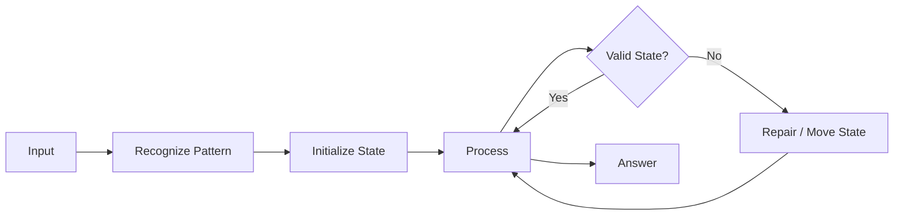

# Visualize Mode 🎯

Every learning module in this repository follows a **Visualize Mode** convention.

## What Visualize Mode means

When a learner asks for `Visualize`, explain the current problem using a small visual state model before the code.

### Required visual sequence

1. **Input** — show the data exactly as the algorithm receives it.
2. **State** — show pointers, map/set, stack, queue, heap, tree, graph, or DP table.
3. **Action** — highlight what changes in the current step.
4. **Invariant** — state what must remain true.
5. **Next state** — show the updated structure.
6. **Output** — show how the final answer is produced.

## Markdown visualization standard

Use Mermaid when a flow/tree/graph is useful:

For arrays and pointers, use a compact table:

| Step | left | right | current | state | result |
|---|---:|---:|---:|---|---|
| 1 | 0 | n-1 | ... | ... | ... |

For trees, use Mermaid flowcharts. For graphs, show vertices and visited edges. For DP, show the table and the recurrence. For stacks/queues/heaps, show the structure after each meaningful operation.

## Visualize mode rules for every problem

Each problem README should contain:

- `## 👁️ Visualize Mode`
- A small input/state/output visualization
- A dry-run table for at least one example
- The algorithm invariant
- A link to Java and Python implementations
- Sample input and output
- Test cases

## Language-specific visualization

**Java:** explain important variables and collection operations alongside the visual state.

**Python:** explain important variables and Python collection operations alongside the visual state.

## Do not use visualization as decoration

A diagram must explain the algorithm. Do not add a diagram that does not correspond to the actual state transitions.

## Learner command

Use this request format anywhere in the course:

> **Visualize this problem step by step.**

The expected response should walk through the actual algorithm state, not merely repeat the code.
