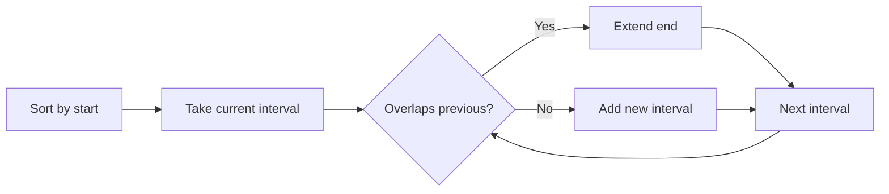

# Merge Intervals

**Pattern:** Intervals + Sorting
**Level:** Medium
**Source:** LeetCode 56

## What is the topic?

An interval is a range such as `[1,3]`. The intervals pattern is used when ranges overlap, merge, contain, or conflict with one another.

## Recognition

Think **sort + interval scan** when the problem talks about meetings, ranges, time periods, or overlapping segments.

## Core idea

Sort by start time. Keep the last merged interval. If the next interval starts before or at the current end, extend the end. Otherwise start a new interval.

## Complexity

- Time: `O(n log n)` because of sorting
- Space: `O(n)` for the output

## 👁️ Visualize Mode

Example: `[1,3] [2,6] [8,10] [15,18]`

| Step | Current | Merged state |
|---|---|---|
| 1 | `[1,3]` | `[[1,3]]` |
| 2 | `[2,6]` | `[[1,6]]` |
| 3 | `[8,10]` | `[[1,6],[8,10]]` |
| 4 | `[15,18]` | `[[1,6],[8,10],[15,18]]` |

## Sample

Input: `[[1,3],[2,6],[8,10],[15,18]]`

Output: `[[1,6],[8,10],[15,18]]`

## Test cases

- `[[1,4],[4,5]] -> [[1,5]]`
- `[[1,2],[3,4]] -> [[1,2],[3,4]]`
- `[[1,10]] -> [[1,10]]`

## Files

- Java: `java/Solution.java`
- Python: `python/solution.py`
