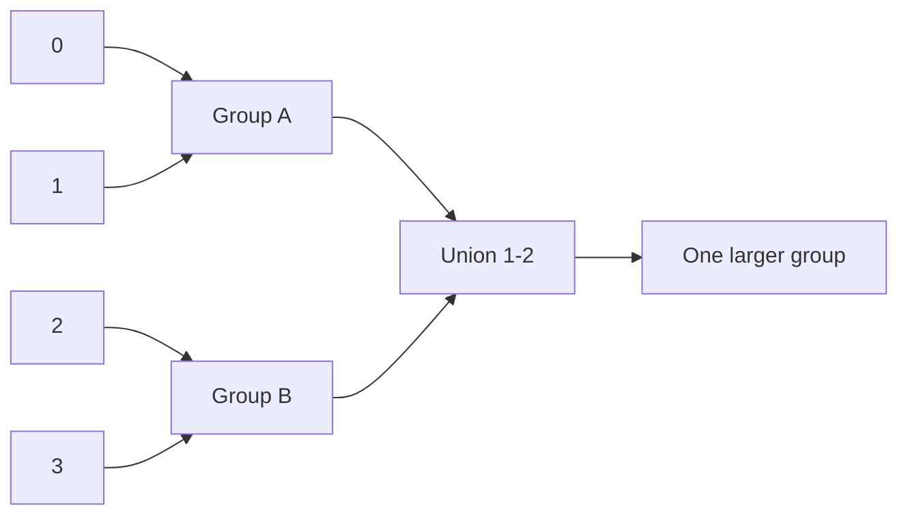

# Number of Connected Components in an Undirected Graph

**Pattern:** Union-Find / DSU
**Level:** Medium
**Source:** LeetCode 323

## What is the topic?

Union-Find keeps track of which elements belong to the same connected group. It is useful for dynamic connectivity, grouping, cycle detection, and MST-related problems.

## Recognition

Use DSU when edges repeatedly **join groups** and you need to know whether two nodes are already connected.

## Core operations

- `find(x)` — find the representative of x's group
- `union(a,b)` — merge two groups
- Path compression makes future finds fast.
- Union by size/rank keeps trees shallow.

## 👁️ Visualize Mode

Example edges: `0-1`, `1-2`, `3-4`

| Operation | Groups |
|---|---|
| Start | `{0} {1} {2} {3} {4}` |
| union(0,1) | `{0,1} {2} {3} {4}` |
| union(1,2) | `{0,1,2} {3} {4}` |
| union(3,4) | `{0,1,2} {3,4}` |

## Sample

Input: `n=5, edges=[[0,1],[1,2],[3,4]]`

Output: `2`

## Test cases

- `n=5, [[0,1],[1,2],[3,4]] -> 2`
- `n=4, [[0,1],[2,3],[1,3]] -> 1`
- `n=1, [] -> 1`

## Files

- Java: `java/Solution.java`
- Python: `python/solution.py`
