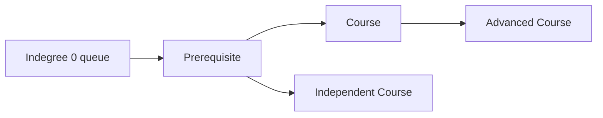

# Course Schedule

**Pattern:** Graph + Topological Sort
**Level:** Medium
**Source:** LeetCode 207

## What is the topic?

Topological sorting orders a directed acyclic graph so every prerequisite appears before the item that depends on it.

## Recognition

Look for **prerequisites, dependencies, ordering, build systems, course requirements**.

## Core idea

Use indegree. Start with nodes whose indegree is zero. Remove them and reduce the indegree of their neighbors. If every course is processed, there is no cycle.

## 👁️ Visualize Mode

For `[[1,0],[2,1]]`:

`0 -> 1 -> 2`

Processing order: `0, 1, 2`.

If a cycle exists, the queue eventually becomes empty before all nodes are processed.

## Sample

Input: `numCourses=2, prerequisites=[[1,0]]`

Output: `true`

## Test cases

- `2, [[1,0]] -> true`
- `2, [[1,0],[0,1]] -> false`
- `3, [] -> true`

## Files

- Java: `java/Solution.java`
- Python: `python/solution.py`
