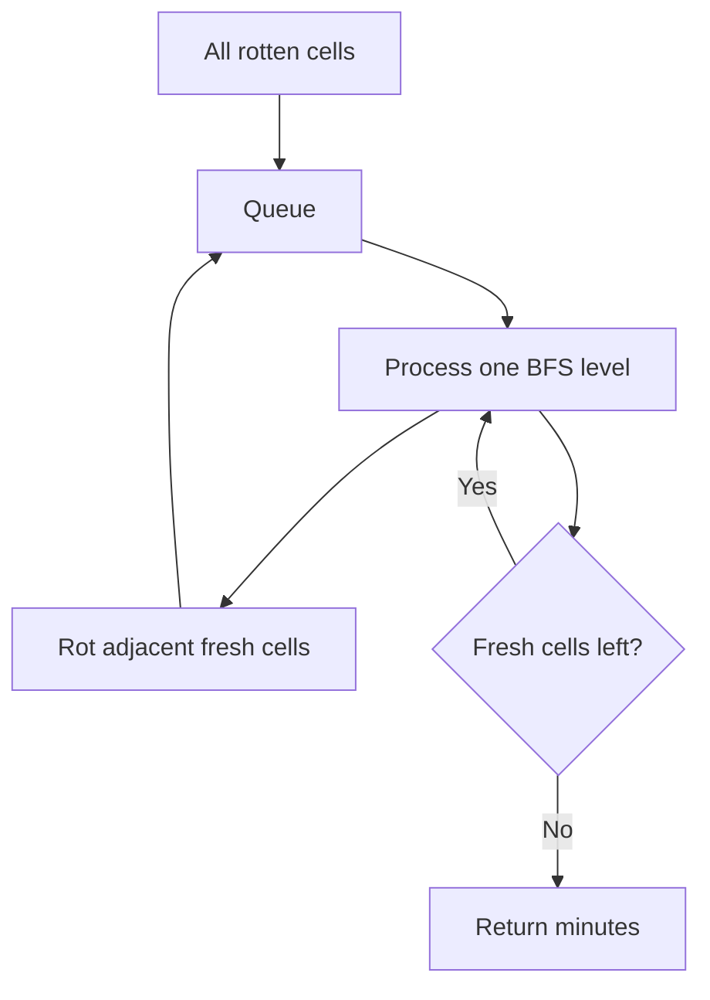

# Rotting Oranges

**Pattern:** Multi-source BFS
**Level:** Medium
**Source:** LeetCode 994

## What is the topic?

Multi-source BFS starts from **all sources at the same time**. It is ideal when a process spreads through neighboring cells in rounds or minutes.

## Recognition

Look for words such as **spread, infection, fire, distance from nearest source, minutes, levels**.

## Core idea

Put every initially rotten orange into the queue. Process the queue level by level. Each BFS level represents one minute.

## 👁️ Visualize Mode

Example:

`2 1 1` → `2 2 1` → `2 2 2`

Each layer is one minute.

## Sample

Input: `[[2,1,1],[1,1,0],[0,1,1]]`

Output: `4`

## Test cases

- `[[2,1,1],[1,1,0],[0,1,1]] -> 4`
- `[[2,1,1],[0,1,1],[1,0,1]] -> -1`
- `[[0,2]] -> 0`

## Files

- Java: `java/Solution.java`
- Python: `python/solution.py`
