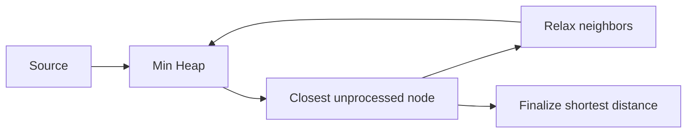

# Network Delay Time

**Pattern:** Weighted Graph + Dijkstra
**Level:** Medium
**Source:** LeetCode 743

## What is the topic?

Dijkstra finds shortest paths from one source when edge weights are non-negative.

## Recognition

Look for **minimum travel time, shortest distance, weighted edges, non-negative costs**.

## Core idea

Keep the best known distance to each node in a min-heap. Always process the currently closest node and relax its outgoing edges.

## 👁️ Visualize Mode

## Sample

Input: `times=[[2,1,1],[2,3,1],[3,4,1]], n=4, k=2`

Output: `2`

## Test cases

- Above example -> `2`
- `times=[[1,2,1]], n=2, k=1 -> 1`
- Disconnected graph -> `-1`

## Files

- Java: `java/Solution.java`
- Python: `python/solution.py`
