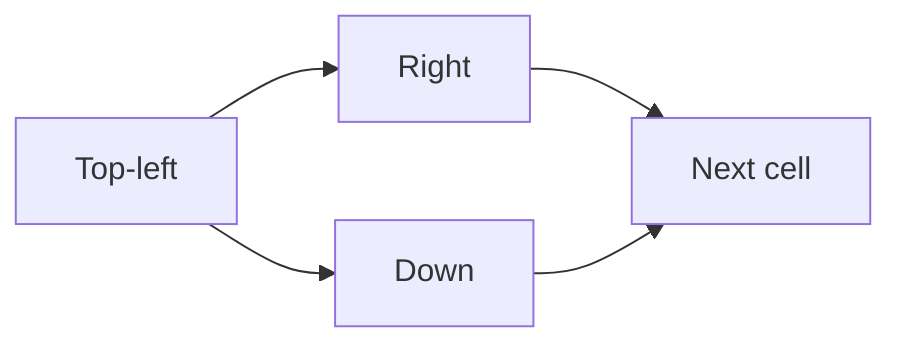

# Unique Paths

**Pattern:** Grid / 2D Dynamic Programming
**Level:** Medium
**Source:** LeetCode 62

## What is the topic?

Grid DP solves problems where the answer at one cell depends on answers from previously solved neighboring cells.

## Recognition

Look for a grid, movement rules, and a count/minimum/maximum over paths.

## Core idea

For only right/down movement: `dp[r][c] = dp[r-1][c] + dp[r][c-1]`.

## 👁️ Visualize Mode

Each cell combines the number of ways from its top and left neighbors.

## Sample

Input: `m=3, n=7`

Output: `28`

## Test cases

- `3,7 -> 28`
- `3,2 -> 3`
- `1,1 -> 1`

## Files

- Java: `java/Solution.java`
- Python: `python/solution.py`
