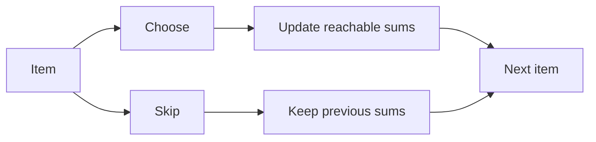

# Partition Equal Subset Sum

**Pattern:** 0/1 Knapsack / Subset DP
**Level:** Medium
**Source:** LeetCode 416

## What is the topic?

Subset DP answers whether a target sum can be formed by choosing each item at most once.

## Recognition

Look for **choose or skip**, target sum, capacity, subset, partition, or each item used once.

## Core idea

If the total sum is odd, partition is impossible. Otherwise target is `sum / 2`. Use boolean DP where `dp[s]` means sum `s` is reachable. Iterate sums backward so each number is used once.

## 👁️ Visualize Mode

Backward iteration is essential for 0/1 knapsack.

## Sample

Input: `[1,5,11,5]`

Output: `true`

## Test cases

- `[1,5,11,5] -> true`
- `[1,2,3,5] -> false`
- `[2,2,2,2] -> true`

## Files

- Java: `java/Solution.java`
- Python: `python/solution.py`
