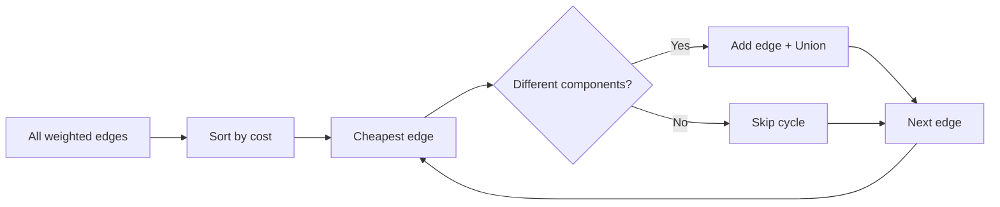

# Min Cost to Connect All Points

**Pattern:** Minimum Spanning Tree + Union-Find
**Level:** Medium
**Source:** LeetCode 1584

## What is the topic?

A Minimum Spanning Tree connects every vertex with minimum total edge cost and no cycle.

## Recognition

Look for **connect all nodes as cheaply as possible**, network construction, roads, cables, or minimum total connection cost.

## Core idea

Generate candidate weighted edges, sort them, then use DSU. Add an edge only when it joins two different components.

## 👁️ Visualize Mode

## Sample

Input: `[[0,0],[2,2],[3,10],[5,2],[7,0]]`

Output: `20`

## Test cases

- `[[0,0],[2,2],[3,10],[5,2],[7,0]] -> 20`
- `[[0,0]] -> 0`
- Two points -> Manhattan distance between them

## Files

- Java: `java/Solution.java`
- Python: `python/solution.py`
