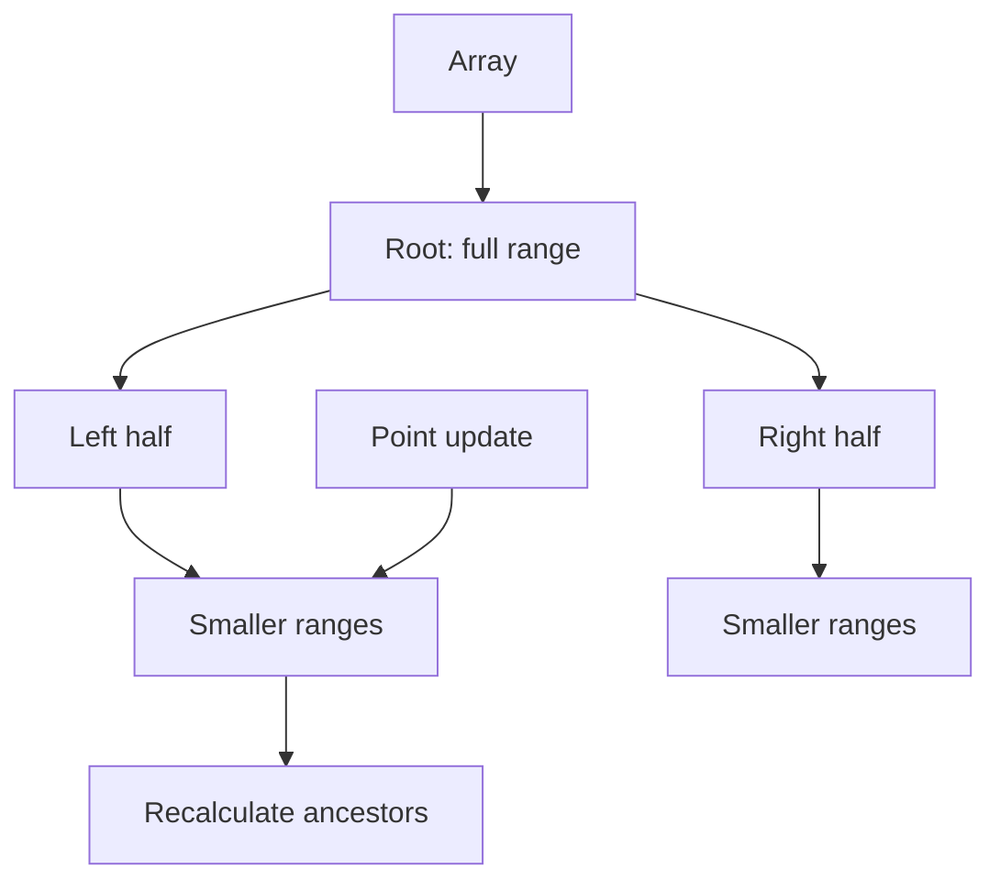

# Range Sum Query - Mutable

**Pattern:** Segment Tree
**Level:** Medium
**Source:** LeetCode 307

## What is the topic?
A segment tree stores information about array ranges. It supports point updates and range queries efficiently.

## Recognition
Think segment tree when there are many range queries plus updates and `O(n)` scanning per query is too slow.

## Core idea
Each node represents an interval and stores its sum. A point update changes one leaf and recalculates its ancestors. A query combines only nodes fully or partially covering the requested range.

## Syntax template
### Java
```java
class NumArray {
    int[] tree;
    void update(int index, int value) { }
    int sumRange(int left, int right) { }
}
```
### Python
```python
class NumArray:
    def update(self, index, value):
        pass
    def sumRange(self, left, right):
        pass
```

## Complexity
- Build: `O(n)`
- Update: `O(log n)`
- Query: `O(log n)`
- Space: `O(n)`

## 👁️ Visualize Mode


Example: for `[1,3,5,7]`, a query `[1,3]` combines covered tree segments instead of scanning every array element.

| Step | Action | State |
|---|---|---|
| 1 | Build | every node stores a range sum |
| 2 | Query `[1,3]` | combine covered nodes |
| 3 | Update index `1` | change one leaf |
| 4 | Pull upward | parent sums are recalculated |

## Sample
`[1,3,5] -> sumRange(0,2)=9 -> update(1,2) -> sumRange(0,2)=8`

## Tests
See `tests/test_cases.md`.

## Files
- Java: `java/NumArray.java`
- Python: `python/solution.py`
- Tests: `tests/test_cases.md`
