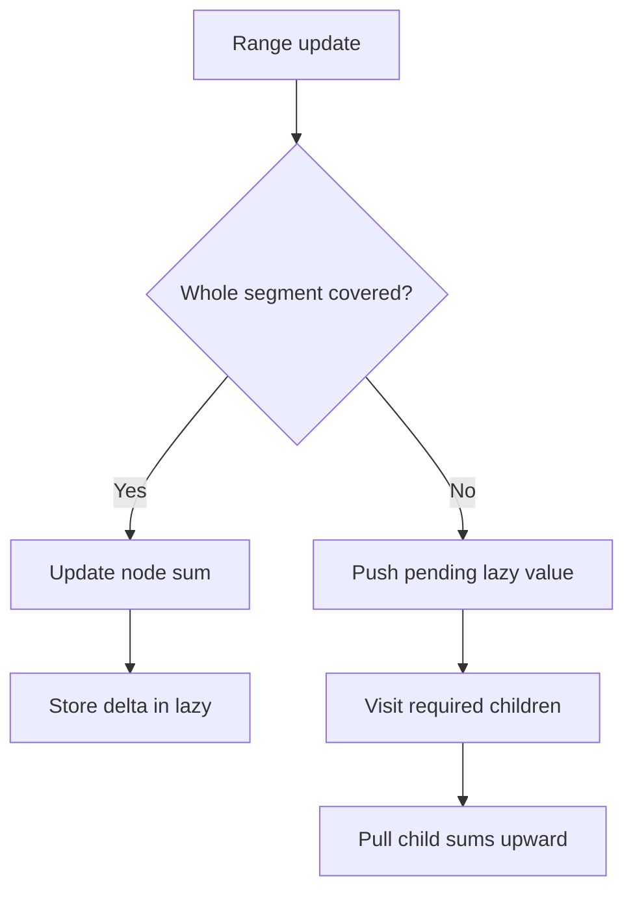

# Lazy Propagation Segment Tree — Range Add + Range Sum

**Pattern:** Segment Tree + Lazy Propagation
**Level:** Advanced
**Source:** General DSA / range-query pattern

## What is the topic?
A lazy segment tree supports **range updates** and **range queries** without visiting every element in the updated range.

For this module the operations are:
- add `delta` to every value in `[left, right]`;
- return the sum of `[left, right]`.

## When should I think about it?
Use lazy propagation when a problem has many:
- range updates;
- range sum/min/max queries;
- operations where updating every element directly would be `O(n)`.

## Core idea
Each tree node stores the sum of its segment. If a whole segment receives an update, we update that node's sum immediately and save the pending addition in `lazy[node]` instead of pushing the change into every child.

When we later need to visit a child, `push()` sends the pending change down.

## State / invariant
For every node:

`tree[node] = correct sum of its segment including all updates already applied to that segment.`

`lazy[node] = update still waiting to be propagated to the children.`

## Syntax template
### Java
```java
void rangeAdd(int left, int right, long delta) { }
long rangeSum(int left, int right) { }
```

### Python
```python
def range_add(left, right, delta):
    pass

def range_sum(left, right):
    pass
```

## Brute force vs optimized
Brute force changes every element in the range: `O(n)` per update.

Lazy propagation reduces both range update and range query to `O(log n)`.

## Complexity
- Build: `O(n)`
- Range add: `O(log n)`
- Range sum: `O(log n)`
- Space: `O(n)`

## 👁️ Visualize Mode


Example array: `[1, 3, 5, 7]`

| Step | Action | State |
|---|---|---|
| 1 | Build | root sum = 16 |
| 2 | Add `2` to `[1,3]` | affected segment sums increase |
| 3 | Query `[1,3]` | return updated sum = 21 |
| 4 | Push only when needed | children receive deferred updates |

## Sample
Input operations:
```text
nums = [1,3,5,7]
rangeAdd(1,3,2)
rangeSum(0,3)
rangeSum(1,2)
```

Output:
```text
22
12
```

## Edge cases
- empty array;
- one element;
- update covers the whole array;
- query is exactly one element;
- multiple overlapping range updates;
- negative update values.

## Platform transfer
Use the same method body for judge/function platforms. For stdin/stdout platforms, add a thin parser around `rangeAdd` and `rangeSum`; keep the tree logic unchanged.

## Files
- Java: `java/Solution.java`
- Python: `python/solution.py`
- Tests: `tests/test_cases.md`
