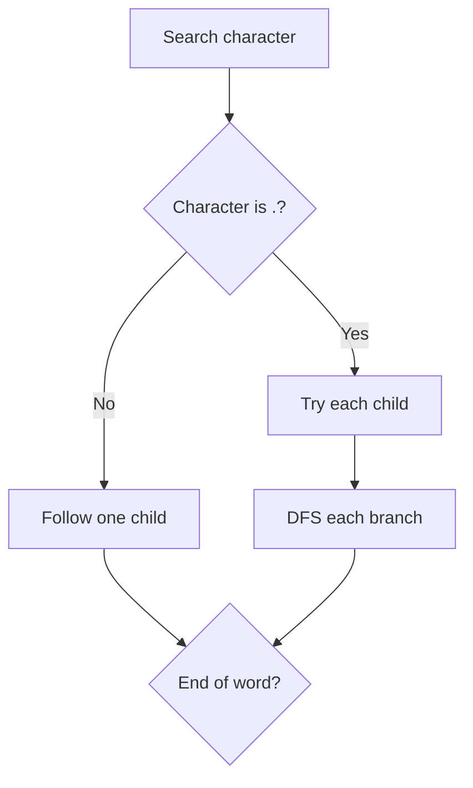

# Design Add and Search Words Data Structure

**Pattern:** Trie + DFS / Backtracking
**Level:** Medium
**Source:** LeetCode 211

## What is the topic?
A trie stores strings character by character. The advanced part here is the `.` wildcard: it can match any one character, so searching may branch into several trie children.

## Recognition
Use a trie when many words share prefixes. Add DFS when the search pattern contains a wildcard or another choice that can branch.

## Core idea
Normal letters follow one child. For `.`, try every existing child recursively. Stop when the pattern is exhausted and check the terminal marker.

## Syntax template
### Java
```java
class Node { Node[] next = new Node[26]; boolean word; }
void addWord(String word) { }
boolean search(String pattern) { return dfs(root, pattern, 0); }
```
### Python
```python
class Node:
    def __init__(self):
        self.children = {}
        self.word = False
```

## Complexity
- Insert: `O(L)`
- Search without wildcard: `O(L)`
- Search with wildcards: worst case `O(26^L)` branching, bounded by stored trie structure
- Space: `O(total characters)`

## 👁️ Visualize Mode


Example words: `bad`, `dad`, `mad`. Search `pad` fails; search `.ad` explores `b`, `d`, and `m` branches.

## Sample
Operations: `addWord("bad")`, `addWord("dad")`, `addWord("mad")`, `search(".ad")`

Output: `true`

## Tests
See `tests/test_cases.md`.

## Files
- Java: `java/WordDictionary.java`
- Python: `python/word_dictionary.py`
- Tests: `tests/test_cases.md`
