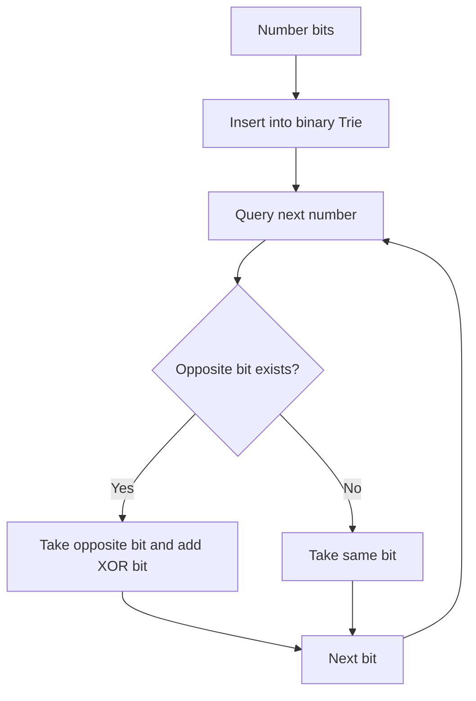

# Maximum XOR Pair — Binary Trie

**Pattern:** Binary Trie + Greedy Bit Choice
**Level:** Advanced
**Source:** LeetCode 421

## What is the topic?
A normal Trie stores characters. A **binary Trie** stores bits `0` and `1`.

For each number, we try to choose the opposite bit at each position because `1 XOR 0 = 1` is better than `0 XOR 0 = 0`.

## Recognition
Think binary Trie when:
- the problem asks for maximum/minimum XOR;
- values fit into a fixed number of bits;
- pairwise comparison of all numbers would be too slow.

## Core idea
Insert each number from the most significant bit to the least significant bit. While querying a number, prefer the opposite bit whenever it exists.

## Invariant
At bit position `b`, the query has chosen the best possible prefix of the XOR value so far.

## Syntax template
### Java
```java
int findMaximumXOR(int[] nums) { }
```
### Python
```python
def find_maximum_xor(nums: list[int]) -> int:
    pass
```

## Brute force vs optimized
Brute force checks every pair: `O(n²)`.

Binary Trie: build `O(31n)` and query `O(31n)`, effectively `O(n)` for fixed-width integers.

## Complexity
- Time: `O(31n)` for non-negative 32-bit integers
- Space: `O(31n)` worst case

## 👁️ Visualize Mode


Example `[3,10,5,25,2,8]`:

```text
3  = 00011
25 = 11001
XOR = 11010 = 26
```

The Trie makes the `25` choice discoverable without comparing it against every number.

## Sample
Input:
```text
[3,10,5,25,2,8]
```
Output:
```text
28
```

## Edge cases
- one element -> `0`;
- duplicate values;
- many equal prefixes;
- values with leading zero bits;
- the all-zero array.

## Platform transfer
Keep the 32-bit method for LeetCode-style submissions. For CodeChef/HackerEarth/stdin-style tasks, add input parsing only. For CodeSignal/Codility/CoderPad, expose the same function and retain deterministic tests.

## Files
- Java: `java/Solution.java`
- Python: `python/solution.py`
- Tests: `tests/test_cases.md`
