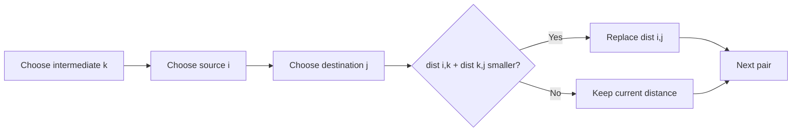

# Floyd-Warshall - All Pairs Shortest Path

**Pattern:** Dynamic Programming on Graphs
**Level:** Advanced

## What is the topic?
Floyd-Warshall computes the shortest distance between **every pair** of vertices. It repeatedly asks whether going through an intermediate vertex improves a path.

## Recognition
Use it when:
- the graph is relatively small and dense
- you need distances for many source-destination pairs
- negative edges may exist but there are no negative cycles

## Core recurrence
`dist[i][j] = min(dist[i][j], dist[i][k] + dist[k][j])`

The outer loop over `k` is essential: after iteration `k`, paths are allowed to use vertices `0..k` as intermediates.

## Syntax template
### Java
```java
for (int k = 0; k < n; k++)
    for (int i = 0; i < n; i++)
        for (int j = 0; j < n; j++)
            dist[i][j] = Math.min(dist[i][j], dist[i][k] + dist[k][j]);
```
### Python
```python
for k in range(n):
    for i in range(n):
        for j in range(n):
            dist[i][j] = min(dist[i][j], dist[i][k] + dist[k][j])
```

## Complexity
- Time: `O(V^3)`
- Space: `O(V^2)`

## 👁️ Visualize Mode


Example edges: `0->1=5`, `1->2=2`, `0->2=10`. When `k=1`, `0->1->2 = 7`, so `dist[0][2]` changes from `10` to `7`.

## Sample
Input matrix:
`[[0,5,10],[INF,0,2],[INF,INF,0]]`

Output:
`[[0,5,7],[INF,0,2],[INF,INF,0]]`

## Tests
See `tests/test_cases.md`.

## Files
- Java: `java/Solution.java`
- Python: `python/solution.py`
- Tests: `tests/test_cases.md`
