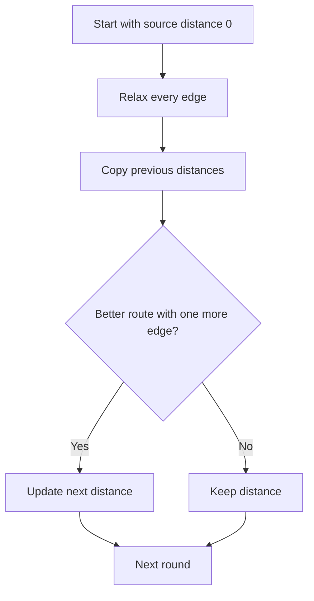

# Cheapest Flights Within K Stops

**Pattern:** Bellman-Ford style relaxation / bounded DP
**Level:** Medium-Advanced
**Source:** LeetCode 787

## What is the topic?
Bellman-Ford repeatedly relaxes every edge. A useful variation is limiting the number of rounds, which limits how many edges a path can use.

## Recognition
Think Bellman-Ford when edges can have negative weights, or when the problem explicitly limits the number of edges/stops.

## Core idea
For at most `k + 1` flights, perform `k + 1` relaxation rounds. Use a copy of the previous distances so one round cannot accidentally use more than one new edge.

## Syntax template
### Java
```java
for (int round = 0; round <= k; round++) {
    int[] next = dist.clone();
    for (int[] edge : flights) {
        // relax using dist, write into next
    }
    dist = next;
}
```
### Python
```python
for _ in range(k + 1):
    next_dist = dist[:]
    for source, target, price in flights:
        # relax from previous round
        pass
    dist = next_dist
```

## Complexity
- Time: `O(K * E)`
- Space: `O(V)`

## 👁️ Visualize Mode


Example: `0 -> 1 = 100`, `1 -> 2 = 100`, `0 -> 2 = 500`. With one stop, the answer becomes `200` because two edges are allowed.

## Sample
Input: `n=3`, flights `[[0,1,100],[1,2,100],[0,2,500]]`, `src=0`, `dst=2`, `k=1`

Output: `200`

## Tests
See `tests/test_cases.md`.

## Files
- Java: `java/Solution.java`
- Python: `python/solution.py`
- Tests: `tests/test_cases.md`
