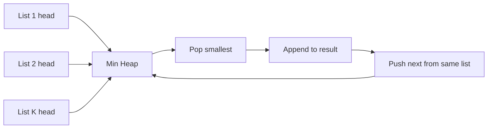

# Merge K Sorted Lists

**Pattern:** K-way Merge + Min Heap
**Level:** Advanced
**Source:** LeetCode 23

## What is the topic?
K-way merge combines multiple already-sorted sequences into one sorted sequence. A min-heap keeps the smallest currently available item from each list.

## Recognition
Look for multiple sorted arrays/lists and a need to repeatedly choose the global smallest next value.

## Core idea
Put the head of every non-empty list into a min-heap. Pop the smallest node, append it, then push that node's next element.

## Syntax template
### Java
```java
PriorityQueue<Node> heap = new PriorityQueue<>((a,b) -> Integer.compare(a.val,b.val));
```
### Python
```python
heapq.heappush(heap, (node.val, list_id, node))
```

## Complexity
For `N` total nodes and `K` lists: `O(N log K)` time and `O(K)` heap space.

## 👁️ Visualize Mode


| Step | Heap idea | Result |
|---|---|---|
| 1 | first element from each list | empty |
| 2 | pop global minimum | append it |
| 3 | push its successor | continue |

## Sample
Input: `[[1,4,5],[1,3,4],[2,6]]`

Output: `[1,1,2,3,4,4,5,6]`

## Tests
See `tests/test_cases.md`.

## Files
- Java: `java/Solution.java`
- Python: `python/solution.py`
- Tests: `tests/test_cases.md`
