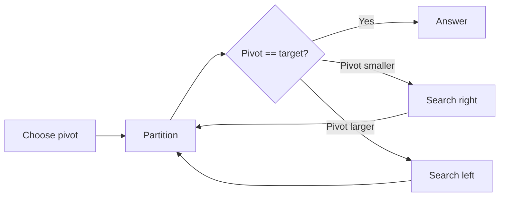

# Kth Largest Element in an Array

**Pattern:** Quickselect
**Level:** Medium
**Source:** LeetCode 215

## What is the topic?
Quickselect uses partitioning like quicksort but continues only in the partition containing the target index.

## Recognition
Use it for a single kth-smallest/kth-largest selection when full sorting is unnecessary.

## Core idea
For kth largest, convert to zero-based target `n-k`. Partition around a pivot. If the pivot lands at target, stop; otherwise continue on the required side.

## Syntax template
### Java
```java
int target = nums.length - k;
while (left <= right) {
    int pivot = partition(nums, left, right);
    if (pivot == target) return nums[pivot];
    if (pivot < target) left = pivot + 1;
    else right = pivot - 1;
}
```
### Python
```python
while left <= right:
    p = partition(nums, left, right)
    if p == target: return nums[p]
```

## Complexity
- Average time: `O(n)`
- Worst case: `O(n^2)` with poor pivots
- Space: `O(1)` extra for iterative partitioning

## 👁️ Visualize Mode


For `[3,2,1,5,6,4]`, `k=2` means target index `4` in ascending order; the algorithm narrows toward value `5` without fully sorting the array.

## Tests
See `tests/test_cases.md`.

## Files
- Java: `java/Solution.java`
- Python: `python/solution.py`
- Tests: `tests/test_cases.md`
