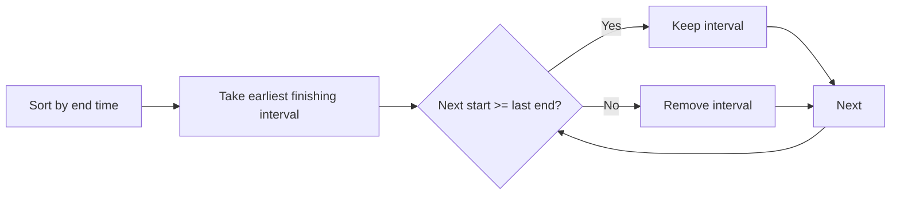

# Non-overlapping Intervals

**Pattern:** Interval Scheduling + Greedy
**Level:** Medium
**Source:** LeetCode 435

## What is the topic?
Interval scheduling chooses compatible intervals. The key greedy rule is to keep the interval that finishes earliest, because it leaves the most room for future intervals.

## Recognition
Look for meetings/jobs/ranges where you want the maximum number of non-overlapping activities or the minimum number to remove.

## Core idea
Sort by end time. Keep the end of the last accepted interval. If the next interval starts before that end, remove it conceptually; otherwise accept it and update the end.

## Syntax template
### Java
```java
Arrays.sort(intervals, (a,b) -> Integer.compare(a[1], b[1]));
int end = Integer.MIN_VALUE;
for (int[] in : intervals) {
    if (in[0] >= end) end = in[1];
}
```
### Python
```python
intervals.sort(key=lambda x: x[1])
for start, end in intervals:
    if start >= last_end:
        last_end = end
```

## Complexity
- Time: `O(n log n)`
- Space: `O(1)` extra apart from sorting/output details

## 👁️ Visualize Mode


Example: `[1,2] [2,3] [3,4]` can all be kept because touching endpoints are compatible. For `[1,3] [2,4]`, keep `[1,3]` because it finishes earlier.

## Sample
Input: `[[1,2],[2,3],[3,4],[1,3]]`

Output: `1`

## Tests
See `tests/test_cases.md`.

## Files
- Java: `java/Solution.java`
- Python: `python/solution.py`
- Tests: `tests/test_cases.md`
