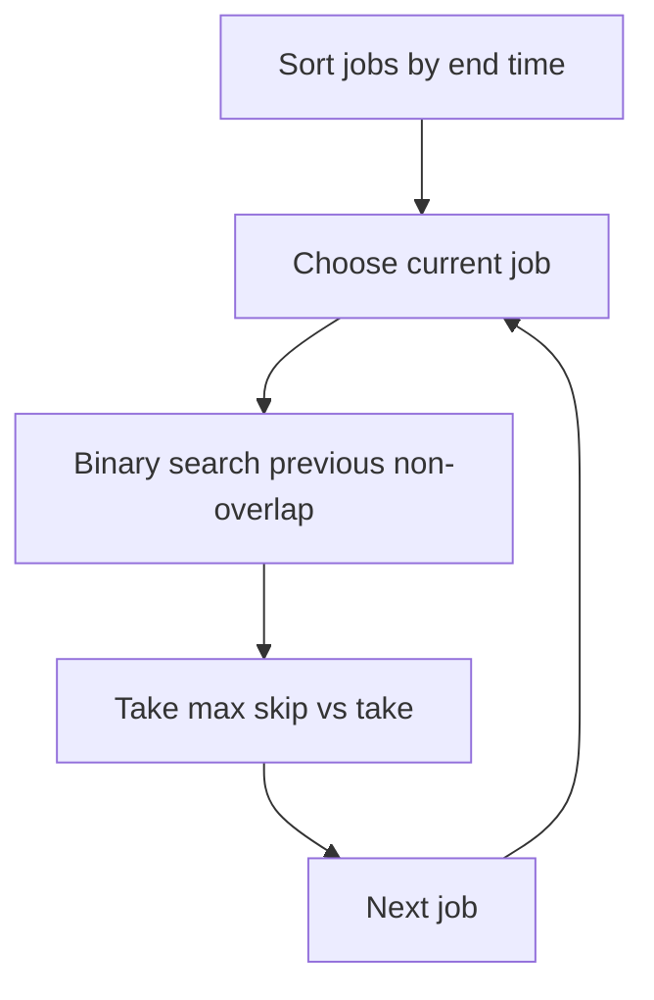

# Weighted Interval Scheduling — Greedy Setup + DP

**Pattern:** Interval Scheduling + Binary Search + DP
**Level:** Advanced
**Source:** General DSA

## What is the topic?
Each job has a start time, end time, and profit. Select non-overlapping jobs to maximize total profit.

Unlike ordinary interval scheduling, choosing the earliest finishing interval alone is not enough because profits differ.

## Recognition
Think weighted interval scheduling when:
- each interval has a value/profit;
- selected intervals cannot overlap;
- the goal is maximum total value.

## State
Sort jobs by ending time.

`dp[i]` = maximum profit using the first `i` jobs.

For job `i`, find `p(i)`, the last job that finishes before this job starts.

```text
 dp[i] = max(dp[i-1], profit[i] + dp[p(i)])
```

## Syntax template
### Java
```java
long maxWeight(int[][] intervals) { }
```
### Python
```python
def max_weight(intervals: list[list[int]]) -> int:
    pass
```

## Brute force vs optimized
Brute force explores subsets and is exponential.

Sorting plus binary search plus DP gives `O(n log n)` time.

## Complexity
- Sort: `O(n log n)`
- Previous-compatible lookup for every job: `O(n log n)`
- DP: `O(n)`
- Total: `O(n log n)`
- Space: `O(n)`

## 👁️ Visualize Mode


Example:
```text
[1,3,50], [2,4,70], [3,5,40], [5,6,60]
```
For each job, the DP compares:
- skip it;
- take it plus the best compatible profit before it.

## Sample
Input:
```text
[[1,3,50],[2,4,70],[3,5,40],[5,6,60]]
```
Output:
```text
110
```
One optimal choice is jobs `[2,4,70]` and `[5,6,60]`.

## Edge cases
- one interval;
- all intervals overlap;
- no intervals overlap;
- same end times;
- zero or negative profit values;
- intervals that touch at an endpoint are compatible under the `end <= start` rule.

## Platform transfer
This is a good advanced DP/greedy problem for CodeChef/HackerEarth-style contests and function-based assessment environments. The binary-search + DP logic remains unchanged across wrappers.

## Files
- Java: `java/Solution.java`
- Python: `python/solution.py`
- Tests: `tests/test_cases.md`
