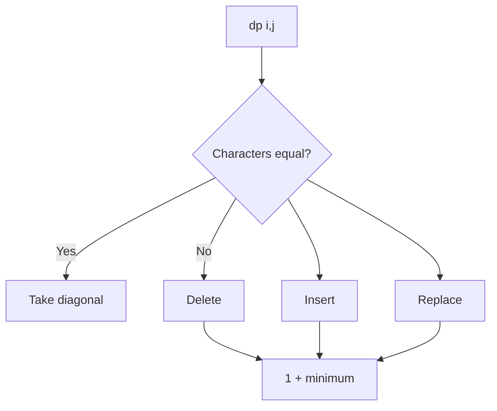

# Edit Distance

**Pattern:** String DP
**Level:** Advanced
**Source:** LeetCode 72

## What is the topic?
Edit distance asks for the minimum number of insertions, deletions, and replacements needed to transform one string into another.

## Recognition
Use 2D string DP when the answer depends on prefixes of two strings and the last characters may match or require an operation.

## State and transition
`dp[i][j]` = minimum edits to transform the first `i` characters of `word1` into the first `j` characters of `word2`.

If the last characters match, use `dp[i-1][j-1]`. Otherwise take one plus the minimum of delete, insert, and replace states.

## Syntax template
### Java
```java
if (a.charAt(i - 1) == b.charAt(j - 1))
    dp[i][j] = dp[i - 1][j - 1];
else
    dp[i][j] = 1 + Math.min(dp[i - 1][j - 1], Math.min(dp[i - 1][j], dp[i][j - 1]));
```
### Python
```python
if a[i - 1] == b[j - 1]:
    dp[i][j] = dp[i - 1][j - 1]
else:
    dp[i][j] = 1 + min(dp[i-1][j-1], dp[i-1][j], dp[i][j-1])
```

## Complexity
- Time: `O(mn)`
- Space: `O(mn)`; can be reduced to `O(min(m,n))`

## 👁️ Visualize Mode


Example `horse -> ros`: each cell compares two prefixes. The table makes the three possible edits visible.

## Sample
Input: `word1="horse", word2="ros"`

Output: `3`

## Tests
See `tests/test_cases.md`.

## Files
- Java: `java/Solution.java`
- Python: `python/solution.py`
- Tests: `tests/test_cases.md`
