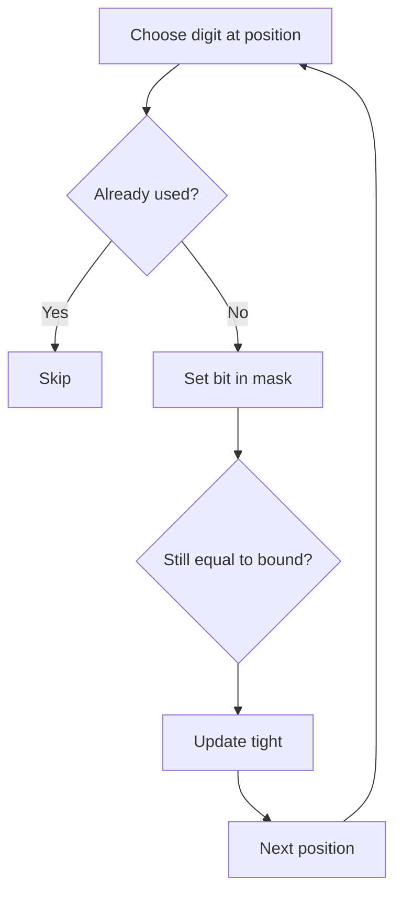

# Numbers With Repeated Digits

**Pattern:** Digit DP + Bitmask
**Level:** Advanced
**Source:** LeetCode 1012

## What is the topic?
Digit DP counts integers up to a bound by processing digits from left to right while remembering which digits have already appeared.

## Recognition
Use digit DP when the bound is large, the property is about decimal digits, and the answer depends on the prefix plus whether it is still equal to the bound prefix.

## State
`pos` = current digit position.
`mask` = used digits.
`started` = whether a non-leading-zero digit has appeared.
`tight` = whether the prefix still equals the bound prefix.

We count positive integers with unique digits, then subtract that count from `n` to obtain the repeated-digit count.

## Syntax template
### Java
```java
int dfs(int pos, int mask, boolean tight, boolean started) { }
```
### Python
```python
@cache
def dfs(pos, mask, tight, started):
    pass
```

## Complexity
With decimal digits, the state space is roughly `O(D * 2^10 * 2 * 2)` and each state tries at most 10 digits.

## 👁️ Visualize Mode


Example bound `20`: choosing `1` at the first position makes the next position unrestricted by the upper bound; choosing `2` keeps the second digit restricted to `0`.

## Sample
Input: `n=20`

The only positive integer from `1..20` with a repeated digit is `11`, so the output is `1`.

## Tests
See `tests/test_cases.md`.

## Files
- Java: `java/Solution.java`
- Python: `python/solution.py`
- Tests: `tests/test_cases.md`
