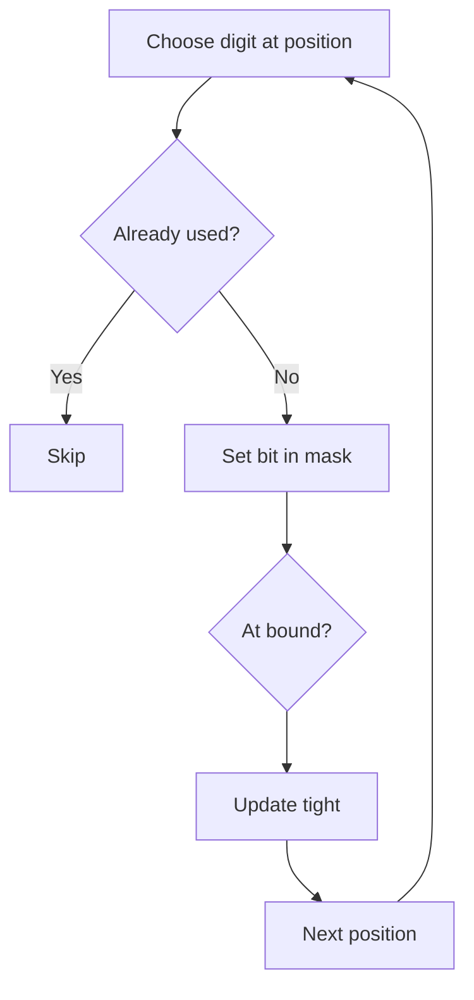

# Numbers With Repeated Digits

**Pattern:** Digit DP + Bitmask
**Level:** Advanced
**Source:** LeetCode 1012

## What is the topic?
Digit DP counts integers up to a bound by processing digits from left to right while remembering which digits have already appeared.

## Recognition
Use digit DP when:
- the upper bound is large
- the property is about decimal digits
- the answer depends on a prefix and whether the current prefix is already smaller than the bound

## State
`pos` = current digit position.
`mask` = used digits.
`started` = whether a non-leading-zero digit has appeared.
`tight` = whether the prefix still equals the bound prefix.

We count numbers with **unique digits**, then subtract from `n` to obtain numbers with repeated digits.

## Syntax template
### Java
```java
int dfs(int pos, int mask, boolean tight, boolean started) { }
```
### Python
```python
@cache
def dfs(pos, mask, tight, started):
    pass
```

## Complexity
With 10 decimal digits: roughly `O(D * 2^10 * 10)` states, where `D` is the number of digits.

## 👁️ Visualize Mode


Example bound `20`: the prefix `1` is below the bound, so the next digit can be chosen more freely. Leading zero is not counted as a used digit.

## Sample
Input: `n=20`

Numbers with repeated digits: `1` (`0` is excluded from the positive-number count), and `11` is the first positive repeated-digit number, so the LeetCode result is `1`.

## Tests
See `tests/test_cases.md`.

## Files
- Java: `java/Solution.java`
- Python: `python/solution.py`
- Tests: `tests/test_cases.md`
