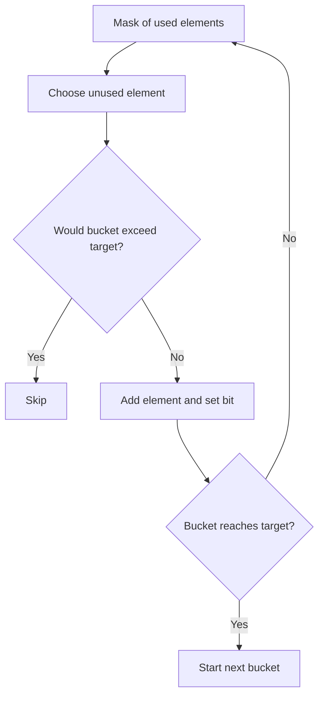

# Partition to K Equal Sum Subsets

**Pattern:** Bitmask DP + Backtracking
**Level:** Advanced
**Source:** LeetCode 698

## What is the topic?
Bitmask DP represents a subset of up to `n` items using one integer. Bit `i` tells whether item `i` has been used.

## Recognition
Use bitmask DP when `n` is small (often around 15-20) and the state is mainly which elements have already been selected.

## Core idea
The mask records used numbers. `current` stores the sum of the currently built bucket modulo the target. When `current == target`, start the next bucket. Memoize masks that have already been proven impossible.

## Syntax template
### Java
```java
boolean dfs(int mask, int currentSum) { }
// try every unused i: mask | (1 << i)
```
### Python
```python
@lru_cache(None)
def dfs(mask, current_sum):
    ...
```

## Complexity
Worst case is exponential, roughly `O(2^n * n)` states/transitions, with memoization and pruning.

## 👁️ Visualize Mode


Example `[4,3,2,3,5,2,1]`, `k=4`, target is `5`. The mask lets the algorithm remember exactly which numbers are already assigned.

## Sample
Input: `nums=[4,3,2,3,5,2,1], k=4`

Output: `true`

## Tests
See `tests/test_cases.md`.

## Files
- Java: `java/Solution.java`
- Python: `python/solution.py`
- Tests: `tests/test_cases.md`
