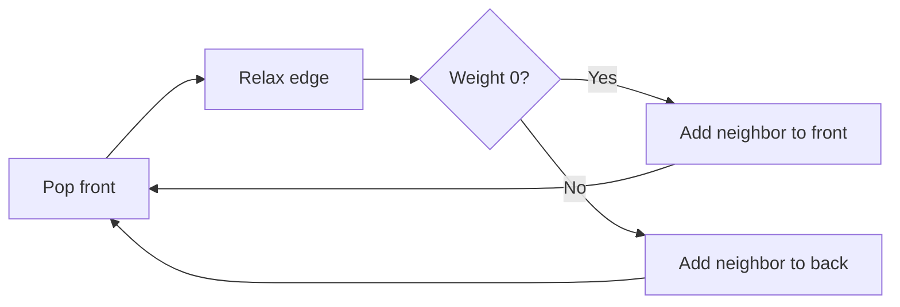

# 0-1 BFS — Shortest Path with Edge Weights 0 or 1

**Pattern:** Deque + Shortest Path
**Level:** Advanced
**Source:** General graph algorithm

## What is the topic?
0-1 BFS finds shortest paths in a graph where every edge weight is exactly `0` or `1`.

It is similar to Dijkstra, but a deque is enough because the next useful distances differ by at most one.

## Recognition
Use 0-1 BFS when:
- the graph is weighted;
- every edge weight is only `0` or `1`;
- you need single-source shortest paths.

## Core idea
When relaxing an edge:
- weight `0` → add the neighbor to the **front**;
- weight `1` → add the neighbor to the **back**.

This keeps smaller tentative distances at the front.

## Invariant
Whenever a vertex is popped for its current shortest distance, the deque ordering ensures no larger-distance vertex needs to be processed first.

## Syntax template
### Java
```java
int[] shortestPath(int n, int[][] edges, int source) { }
```
### Python
```python
def shortest_path(n, edges, source):
    pass
```

## Complexity
- Time: `O(V + E)`
- Space: `O(V + E)`

## 👁️ Visualize Mode


Example edges:
```text
0 -0-> 1
0 -1-> 2
1 -1-> 2
```

Starting at `0`:
- `1` gets distance `0` and goes to the front;
- `2` gets distance `1` and goes to the back;
- the deque processes the smaller distance first.

## Sample
Input:
```text
n = 4
edges = [[0,1,0],[0,2,1],[1,2,1],[2,3,0]]
source = 0
```
Output:
```text
[0,0,1,1]
```

## Edge cases
- unreachable vertices remain `-1`;
- all edges have weight `0`;
- all edges have weight `1`;
- parallel edges;
- a zero-weight cycle.

## Platform transfer
The method can be wrapped for stdin/stdout platforms such as HackerRank, CodeChef, and HackerEarth. Function-based assessment platforms can call it directly.

## Files
- Java: `java/Solution.java`
- Python: `python/solution.py`
- Tests: `tests/test_cases.md`
