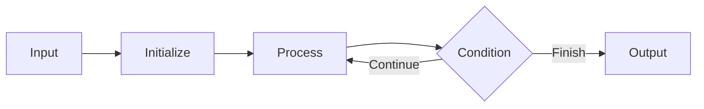

## 👁️ Visualize Mode

### 1. Input
`[show the exact input]`

### 2. Initial State
`[show pointers / map / stack / queue / heap / tree / graph / DP table]`

### 3. Step-by-Step State Changes

| Step | State | Action | Why? | Result |
|---|---|---|---|---|
| 1 | Initial | ... | ... | ... |
| 2 | Updated | ... | ... | ... |

### 4. Invariant
> `[state the rule that remains true during the algorithm]`

### 5. Flow

### 6. Final Output
`[show the exact output]`
